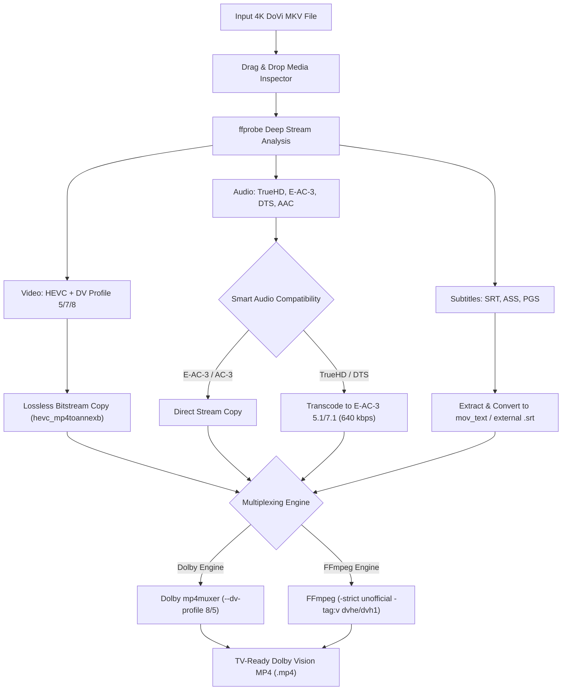

# DoVi Remuxer 🎬✨

<p align="center">
  
</p>

<p align="center">
  <strong>Fast, lossless cross-platform desktop application to convert 4K Dolby Vision MKV videos into TV-compatible MP4 files.</strong>
</p>

<p align="center">
  
  
  
  <a href="https://buymeacoffee.com/sarathsivap" target="_blank">
    
  </a>
  
</p>

---

## 📺 Why DoVi Remuxer?

Many modern 4K HDR TVs (such as **LG OLEDs running webOS**, **Sony Bravia Google TVs**, and streaming boxes like **Apple TV 4K**) natively support Dolby Vision **only when containerized inside MP4 (`.mp4`)**. When playing 4K Dolby Vision MKV files directly over USB or local DLNA media servers, TVs frequently:
1. Fall back to standard HDR10 or washed-out SDR.
2. Throw an **"Audio format not supported"** error due to TrueHD / DTS audio tracks.
3. Drop or corrupt subtitle tracks because MKV subtitle formats (PGS/ASS) are incompatible with standard MP4 containers.

**DoVi Remuxer** solves this with a clean, drag-and-drop standalone app that:
- **Preserves dynamic Dolby Vision RPU metadata** (Profile 8.1 and Profile 5) without lossy video re-encoding.
- **Smart Audio Transcoding**: Automatically keeps compatible audio (E-AC-3, AC-3, AAC) or transcodes TrueHD Atmos / DTS tracks into high-bitrate **Dolby Digital Plus (E-AC-3 5.1/7.1)** so TVs play sound flawlessly.
- **Subtitle Adaptation**: Extracts and embeds subtitles into standard MP4 Timed Text (`mov_text`) and/or exports `.srt` files alongside the video.
- **Dual Muxer Engines**: Supports official Dolby Laboratories `mp4muxer` and modern FFmpeg direct remuxing with automatic fallback.

---

## 🚀 Architecture & Workflow



---

## 🎯 TV Compatibility Matrix

| Playback Device | Dolby Vision Profile | Recommended Audio | Subtitles in MP4 |
| :--- | :--- | :--- | :--- |
| **LG OLED (webOS 3.5 - webOS 24)** | Profile 8.1 & Profile 5 | E-AC-3 (Dolby Digital Plus) / AC-3 | `mov_text` or External `.srt` |
| **Sony Bravia (Google TV / Android TV)** | Profile 8.1 & Profile 5 | E-AC-3 / AC-3 / TrueHD (via eARC) | `mov_text` or External `.srt` |
| **Apple TV 4K (Infuse / Native Player)** | Profile 8.1 & Profile 5 | E-AC-3 / AAC / Spatial Audio | `mov_text` |
| **Panasonic / Philips OLED** | Profile 8.1 | E-AC-3 / AC-3 | `mov_text` |

---

## ✨ Features

- **Drag and Drop Interface**: Simply drop any `.mkv` video file to instantly inspect embedded video streams, audio codecs, channel layouts, languages, and subtitle tracks.
- **Dolby Vision Metadata Probing**: Detects Dolby Vision configuration records (Profile 5, Profile 7 Dual Layer, Profile 8.1 Single Layer, and BL signal compatibility IDs).
- **Audio Stream Selection**: Choose any number of audio tracks. Smart mode transcodes unsupported TrueHD Atmos/DTS to 640 kbps E-AC-3 while leaving native tracks untouched.
- **Subtitle Handling**: Extract chosen languages into embedded MP4 Timed Text (`mov_text`) and/or create companion `.srt` files.
- **Real-time Pipeline Monitoring**: Step-by-step progress tracking with live percentage, remux speed, and stdout/stderr log console.
- **Graceful Cancellation**: Cancel ongoing jobs at any moment without leaving dangling temporary files.
- **Custom Tool Configuration**: Auto-detects `ffmpeg`, `ffprobe`, and `mp4muxer` from your system PATH, or configure custom binary paths in Settings.

---

## 🛠 Prerequisites

DoVi Remuxer uses **FFmpeg** and optionally **Dolby mp4muxer**:

### 1. Install FFmpeg (Required)
- **macOS (Homebrew)**:
  ```bash
  brew install ffmpeg
  ```
- **Windows (Scoop or Chocolatey)**:
  ```powershell
  scoop install ffmpeg
  # or
  choco install ffmpeg
  ```
- **Linux (Ubuntu / Debian)**:
  ```bash
  sudo apt update && sudo apt install ffmpeg
  ```

### 2. Dolby mp4muxer (Optional)
If present on your system or configured in **Settings**, DoVi Remuxer can invoke Dolby's official streaming muxer. If not installed, DoVi Remuxer automatically uses FFmpeg's built-in Dolby Vision container multiplexer.

---

## 💻 Development & Building from Source

### Install Dependencies
```bash
git clone https://github.com/sarathcodes/dovi-remuxer.git
cd dovi-remuxer
npm install
```

### Run in Development Mode
```bash
npm run dev
```

### Package Cross-Platform Binaries
```bash
# Build for current operating system
npm run dist

# Or target specific platforms:
npm run dist:mac    # Creates .dmg and .zip for macOS (Universal / Apple Silicon / Intel)
npm run dist:win    # Creates .exe installer and portable binary for Windows
npm run dist:linux  # Creates .AppImage and .deb for Linux
```

Executables will be generated in the `release/` directory.

---

## 🤝 Contributing

Contributions are welcome! Please check out [CONTRIBUTING.md](CONTRIBUTING.md) to get started.

1. Fork the Project
2. Create your Feature Branch (`git checkout -b feature/AmazingFeature`)
3. Commit your Changes (`git commit -m 'Add some AmazingFeature'`)
4. Push to the Branch (`git push origin feature/AmazingFeature`)
5. Open a Pull Request

---

## ☕ Support the Project

If **DoVi Remuxer** saved you time or made your 4K Dolby Vision TV setup seamless, consider buying me a coffee! Your support helps keep this tool open-source, maintained, and free.

<p align="center">
  <a href="https://buymeacoffee.com/sarathsivap" target="_blank">
    
  </a>
</p>

---

## 📄 License

Distributed under the **MIT License**. See [LICENSE](LICENSE) for more information.
